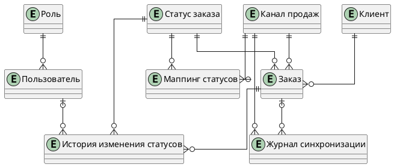
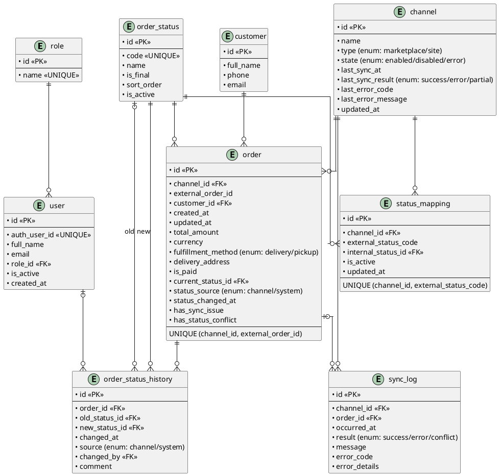
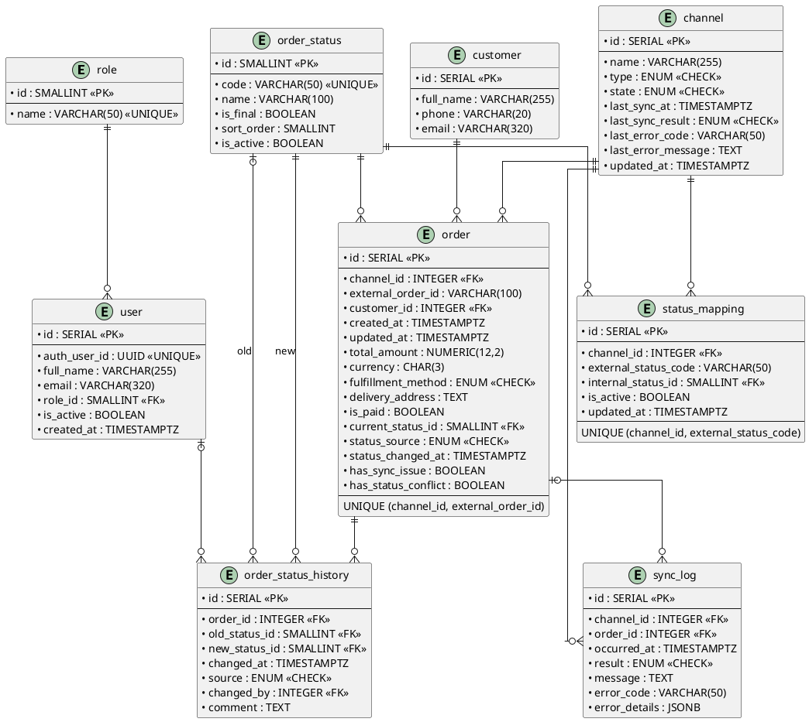

# ERD (3 уровня)

## Уровень 1 — концептуальная модель

```plantuml
@startuml
skinparam linetype ortho

entity "Роль" as Role
entity "Пользователь" as User
entity "Клиент" as Customer
entity "Канал продаж" as Channel
entity "Заказ" as Order
entity "Статус заказа" as Status
entity "История изменения статусов" as StatusHistory
entity "Маппинг статусов" as StatusMapping
entity "Журнал синхронизации" as SyncLog

Role ||--o{ User
Customer ||--o{ Order
Channel  ||--o{ Order
Status   ||--o{ Order

Order  ||--o{ StatusHistory
Status ||--o{ StatusHistory
User   |o--o{ StatusHistory

Channel ||--o{ StatusMapping
Status  ||--o{ StatusMapping

Channel ||--o{ SyncLog
Order   |o--o{ SyncLog

@enduml

```

## Уровень 2 — логическая модель

```plantuml
@startuml
skinparam linetype ortho

entity "role" as role {
  • id «PK»
  --
  • name «UNIQUE»
}

entity "user" as user {
  • id «PK»
  --
  • auth_user_id «UNIQUE»
  • full_name
  • email
  • role_id «FK»
  • is_active
  • created_at
}

entity "channel" as channel {
  • id «PK»
  --
  • name
  • type (enum: marketplace/site)
  • state (enum: enabled/disabled/error)
  • last_sync_at
  • last_sync_result (enum: success/error/partial)
  • last_error_code
  • last_error_message
  • updated_at
}

entity "customer" as customer {
  • id «PK»
  --
  • full_name
  • phone
  • email
}

entity "order_status" as order_status {
  • id «PK»
  --
  • code «UNIQUE»
  • name
  • is_final
  • sort_order
  • is_active
}

entity "order" as order {
  • id «PK»
  --
  • channel_id «FK»
  • external_order_id
  • customer_id «FK»
  • created_at
  • updated_at
  • total_amount
  • currency
  • fulfillment_method (enum: delivery/pickup)
  • delivery_address
  • is_paid
  • current_status_id «FK»
  • status_source (enum: channel/system)
  • status_changed_at
  • has_sync_issue
  • has_status_conflict
  --
  UNIQUE (channel_id, external_order_id)
}

entity "status_mapping" as status_mapping {
  • id «PK»
  --
  • channel_id «FK»
  • external_status_code
  • internal_status_id «FK»
  • is_active
  • updated_at
  --
  UNIQUE (channel_id, external_status_code)
}

entity "order_status_history" as order_status_history {
  • id «PK»
  --
  • order_id «FK»
  • old_status_id «FK»
  • new_status_id «FK»
  • changed_at
  • source (enum: channel/system)
  • changed_by «FK»
  • comment
}

entity "sync_log" as sync_log {
  • id «PK»
  --
  • channel_id «FK»
  • order_id «FK»
  • occurred_at
  • result (enum: success/error/conflict)
  • message
  • error_code
  • error_details
}

role ||--o{ user
channel ||--o{ order
customer ||--o{ order
order_status ||--o{ order

channel ||--o{ status_mapping
order_status ||--o{ status_mapping

order ||--o{ order_status_history
order_status |o--o{ order_status_history : old
order_status ||--o{ order_status_history : new
user |o--o{ order_status_history

channel ||--o{ sync_log
order |o--o{ sync_log

@enduml

```

## Уровень 3 — физическая модель

```plantuml
@startuml
skinparam linetype ortho

entity "role" as role {
  • id : SMALLINT «PK»
  --
  • name : VARCHAR(50) «UNIQUE»
}

entity "user" as user {
  • id : SERIAL «PK»
  --
  • auth_user_id : UUID «UNIQUE»
  • full_name : VARCHAR(255)
  • email : VARCHAR(320)
  • role_id : SMALLINT «FK»
  • is_active : BOOLEAN
  • created_at : TIMESTAMPTZ
}

entity "channel" as channel {
  • id : SERIAL «PK»
  --
  • name : VARCHAR(255)
  • type : ENUM «CHECK»
  • state : ENUM «CHECK»
  • last_sync_at : TIMESTAMPTZ
  • last_sync_result : ENUM «CHECK»
  • last_error_code : VARCHAR(50)
  • last_error_message : TEXT
  • updated_at : TIMESTAMPTZ
}

entity "customer" as customer {
  • id : SERIAL «PK»
  --
  • full_name : VARCHAR(255)
  • phone : VARCHAR(20)
  • email : VARCHAR(320)
}

entity "order_status" as order_status {
  • id : SMALLINT «PK»
  --
  • code : VARCHAR(50) «UNIQUE»
  • name : VARCHAR(100)
  • is_final : BOOLEAN
  • sort_order : SMALLINT
  • is_active : BOOLEAN
}

entity "order" as order {
  • id : SERIAL «PK»
  --
  • channel_id : INTEGER «FK»
  • external_order_id : VARCHAR(100)
  • customer_id : INTEGER «FK»
  • created_at : TIMESTAMPTZ
  • updated_at : TIMESTAMPTZ
  • total_amount : NUMERIC(12,2)
  • currency : CHAR(3)
  • fulfillment_method : ENUM «CHECK»
  • delivery_address : TEXT
  • is_paid : BOOLEAN
  • current_status_id : SMALLINT «FK»
  • status_source : ENUM «CHECK»
  • status_changed_at : TIMESTAMPTZ
  • has_sync_issue : BOOLEAN
  • has_status_conflict : BOOLEAN
  --
  UNIQUE (channel_id, external_order_id)
}

entity "status_mapping" as status_mapping {
  • id : SERIAL «PK»
  --
  • channel_id : INTEGER «FK»
  • external_status_code : VARCHAR(50)
  • internal_status_id : SMALLINT «FK»
  • is_active : BOOLEAN
  • updated_at : TIMESTAMPTZ
  --
  UNIQUE (channel_id, external_status_code)
}

entity "order_status_history" as order_status_history {
  • id : SERIAL «PK»
  --
  • order_id : INTEGER «FK»
  • old_status_id : SMALLINT «FK»
  • new_status_id : SMALLINT «FK»
  • changed_at : TIMESTAMPTZ
  • source : ENUM «CHECK»
  • changed_by : INTEGER «FK»
  • comment : TEXT
}

entity "sync_log" as sync_log {
  • id : SERIAL «PK»
  --
  • channel_id : INTEGER «FK»
  • order_id : INTEGER «FK»
  • occurred_at : TIMESTAMPTZ
  • result : ENUM «CHECK»
  • message : TEXT
  • error_code : VARCHAR(50)
  • error_details : JSONB
}

role ||--o{ user
channel ||--o{ order
customer ||--o{ order
order_status ||--o{ order

channel ||--o{ status_mapping
order_status ||--o{ status_mapping

order ||--o{ order_status_history
order_status |o--o{ order_status_history : old
order_status ||--o{ order_status_history : new
user |o--o{ order_status_history

channel ||--o{ sync_log
order |o--o{ sync_log

@enduml

```
