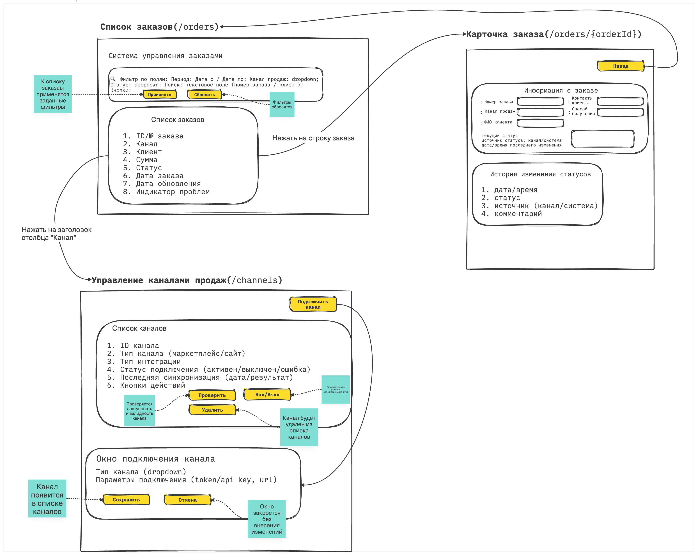

### Макеты

Ссылка на доску: [https://unidraw.io/app/board/13ee2c3b1db7b82f2780?allow_guest=true](https://unidraw.io/app/board/13ee2c3b1db7b82f2780?allow_guest=true)

### Источники данных (endpoints)

|Экран (route)|Элемент/действие|Endpoint|Метод|
|-|-|-|-|
|`/orders`|Загрузка списка заказов (по умолчанию)|`/api/orders?page=&pageSize=`|GET|
|`/orders`|Применить фильтры (период/канал/статус/поиск)|`/api/orders?from=&to=&channelId=&status=&q=&page=&pageSize=`|GET|
|`/orders`|Сбросить фильтры|—
UI-действие: сброс полей + повторный `GET /api/orders` |—|
|`/orders`|Заполнить фильтр “Канал продаж”|`/api/channels`|GET|
|`/orders`|Заполнить фильтр “Статус”|`/api/order-statuses`|GET|
|`/orders`|Клик по строке заказа|`/orders/{orderId}`|—|
|`/orders/{orderId}`|Загрузка карточки заказа|`/api/orders/{orderId}`|GET|
|`/orders/{orderId}`|История статусов заказа|`/api/orders/{orderId}/status-history`|GET|
|`/orders/{orderId}`|Кнопка “Назад”|`/orders`|—|
|`/channels`|Загрузка списка каналов|`/api/channels`|GET|
|`/channels`|Подключить канал (сохранить форму)|`/api/channels`|POST|
|`/channels`|Проверить канал|`/api/channels/{channelId}/health`|GET|
|`/channels`|Включить/выключить канал|`/api/channels/{channelId}/state`|PATCH|
|`/channels`|Удалить канал|`/api/channels/{channelId}`|DELETE|

