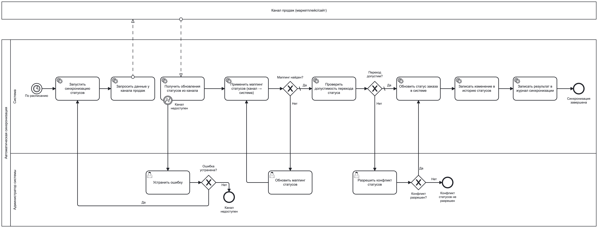
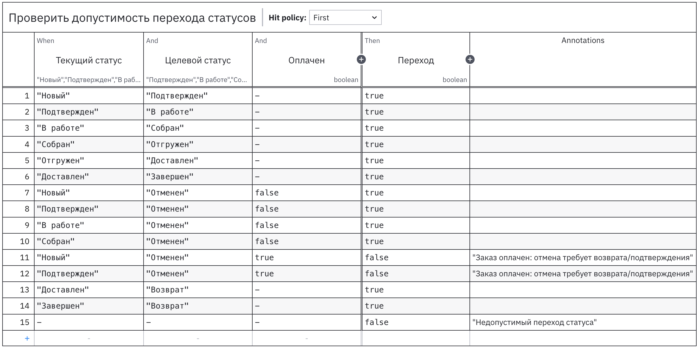

**Бизнес-процесс "Автоматическая синхронизация статусов заказов с каналом продаж" в нотации BPMN:**

[diagram_3.bpmn](Модели+бизнес-процессов+983dc534-c604-4f1e-a412-56ca25c92774/diagram_3.bpmn)

**Бизнес-процесс "Автоматическая синхронизация статусов заказов с каналом продаж" в нотации BPMN с использованием DMN:**

В качестве шага с DMN выбран шаг "Проверить допустимость перехода статусов".

[transition_allowed.xml](Модели+бизнес-процессов+983dc534-c604-4f1e-a412-56ca25c92774/transition_allowed.xml)

Обоснование:

Решение о допустимости перехода заказа из текущего статуса в целевой статус является набором бизнес-правил (матрица переходов и исключения, например отмена оплаченного заказа). Эти правила могут меняться при корректировке процесса обработки заказов или подключении новых каналов. Поэтому проверку допустимости логично вынести в DMN-таблицу, чтобы правила можно было изменять и согласовывать отдельно, не меняя BPMN-процесс и код. BPMN при этом описывает сам процесс: порядок выполнения шагов и сценарии обработки ошибок/исключительных ситуаций.

